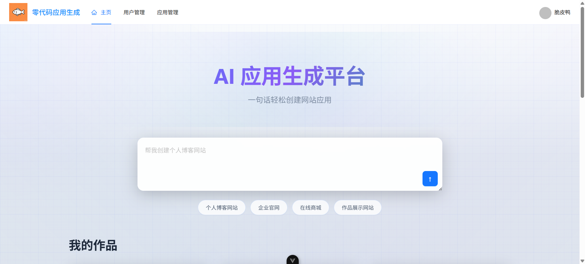
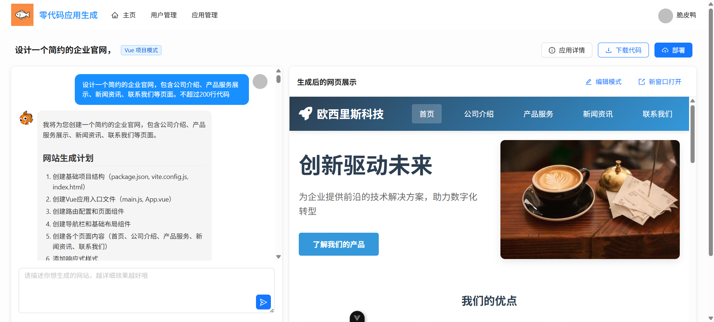
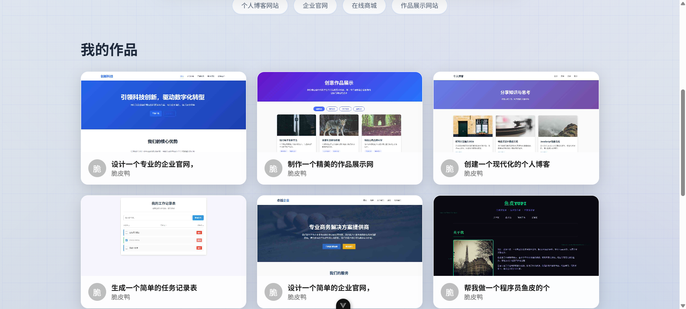
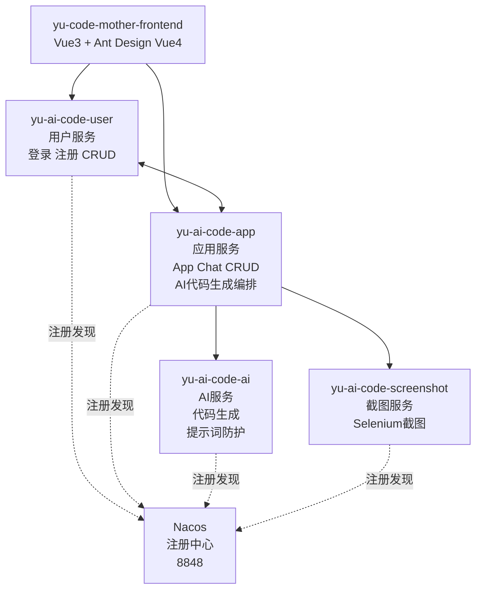

# 零代码应用生成平台 🤖

> **零代码应用生成平台** — 用自然语言描述你的应用想法，AI 自动生成可运行的应用程序。

用户只需用中文描述想要的应用（如"帮我做一个个人博客网站"），平台通过 AI 自动完成：需求分析 → 代码类型路由 → AI 代码生成 → 解析保存 → 项目构建，最终生成可直接部署的 HTML 页面、多文件项目或完整的 Vue 项目。

## 🖥️ 界面截图

### 🏠 首页



### 🤖 AI 对话生成



### 📁 作品管理



---

## 功能特性 ✨

- **🎯 智能路由** — AI 自动识别用户需求，选择 HTML / 多文件 / Vue 项目三种生成模式
- **🤖 AI 驱动生成** — 基于 DeepSeek 大模型 + LangChain4j 框架，流式 SSE 输出代码
- **💬 对话式交互** — 与 AI 对话交互，逐步完善应用，支持代码修改、文件读写等工具调用
- **📦 一键部署与下载** — 生成的应用可直接部署到静态资源服务器或打包 ZIP 下载
- **🔐 用户管理** — 登录注册、Redis Session 会话管理、用户/管理员角色权限
- **⚙️ 代码编辑与迭代** — AI 支持读取、修改、删除生成的文件，支持可视化编辑器
- **📊 AI 监控** — Micrometer + Prometheus 监控 AI 调用量、Token 消耗、响应时间、错误率
- **🔄 应用管理** — 创建、编辑、管理自己的应用，浏览精选应用
- **🎨 现代美观 UI** — Vue 3 + Ant Design Vue 4 + 毛玻璃动效

---

## 🏗️ 架构

### 微服务架构（`main` 分支）



### 共享模块

| 模块 | 说明 |
|------|------|
| `yu-ai-code-common` | 公共工具、异常体系、配置管理、COS 存储 |
| `yu-ai-code-model` | 数据实体、DTO、VO、枚举 |
| `yu-ai-code-client` | Dubbo RPC 客户端接口定义 |

### 单体架构（`Monomer-branch` 分支）

使用 LangGraph4j 工作流编排的 Spring Boot 单体应用，用于工作流特性的研究与实验。

---

## 技术栈 🛠️

### 后端

| 技术 | 版本 | 用途 |
|------|------|------|
| Java | 21 | 运行时 |
| Spring Boot | 3.5.3 | 框架 |
| Spring Cloud Alibaba | 2023.0.1.0 | 微服务治理 |
| Apache Dubbo | 3.3.0 | 服务间 RPC（triple 协议） |
| Nacos | 2.x | 服务注册与发现 |
| MyBatis-Flex | 1.11.6 | ORM |
| MySQL | 8.x | 关系数据库 |
| Redis | 7.x | Session + 缓存 + 分布式锁 |
| Caffeine | - | 本地缓存 |
| LangChain4j | 1.12.2 | AI 模型集成（流式/工具/防护/AI Service） |
| Project Reactor | - | SSE 流式响应 |
| Micrometer + Prometheus | - | AI 模型监控 |
| Selenium + WebDriverManager | 4.33.0 / 6.1.0 | 网页截图 |
| Knife4j | 4.4.0 | Swagger API 文档 |
| DashScope SDK | - | AI 图片生成 |
| 腾讯云 COS | 5.6.227 | 对象/图片存储 |
| Redisson | 3.50.0 | 分布式锁 + 限流 |
| Hutool | 5.8.38 | 工具库 |

### 前端

| 技术 | 版本 | 用途 |
|------|------|------|
| Vue | 3.5 | 框架 |
| TypeScript | 5.8 | 类型安全 |
| Vite | 7 | 构建工具 |
| Ant Design Vue | 4 | UI 组件库 |
| Pinia | 3 | 状态管理 |
| Vue Router | 4 | 路由（含权限守卫） |
| Axios | 1.13 | HTTP 客户端 |
| Markdown-it + Highlight.js | - | AI 回复 Markdown 渲染 |
| @umijs/openapi | - | 自动生成 API 类型 |

---

## 快速开始 🚀

### 前置条件

- JDK 21+
- Maven 3.8+
- MySQL 8.0+
- Redis 7.0+
- Nacos 2.x
- Node.js 20+（前端）

### 1. 克隆项目

```bash
git clone https://github.com/Osiris-02196/ai-nocode.git
cd ai-nocode
```

### 2. 数据库初始化

```sql
source sql/create_table.sql
```

### 3. 启动 Nacos

```bash
# 下载并启动 Nacos 单机模式
sh startup.sh -m standalone
# 访问 http://localhost:8848/nacos
```

### 4. 配置密钥

各服务的 `application.yml` 中已预留配置占位，需填入：
- DeepSeek / Qwen API Key（AI 服务）
- 腾讯云 COS SecretId / SecretKey（公共模块）
- Pexels API Key
- DashScope API Key

### 5. 启动微服务

按顺序启动（每个服务独立终端）：

```bash
cd yu-ai-code-mother-microservice

# 用户服务 :8124
mvn spring-boot:run -pl yu-ai-code-user

# 应用服务 :8125
mvn spring-boot:run -pl yu-ai-code-app

# 截图服务
mvn spring-boot:run -pl yu-ai-code-screenshot

# AI 服务
mvn spring-boot:run -pl yu-ai-code-ai
```

### 6. 启动前端

```bash
cd yu-code-mother-frontend
npm install
npm run dev
```

前端默认运行在 `http://localhost:5173`，Vite 自动代理 `/api` 请求到后端各服务。

---

## 项目结构 📁

```
yu-ai-code-mother/
│
├── yu-ai-code-mother-microservice/         # Maven 多模块微服务
│   ├── yu-ai-code-common/                  # 公共模块
│   │   ├── exception/                      # BusinessException, GlobalExceptionHandler
│   │   ├── common/                         # BaseResponse, ResultUtils
│   │   ├── config/                         # CorsConfig, CosClientConfig
│   │   ├── manager/CosManager.java         # 腾讯云 COS 操作
│   │   ├── annotation/AuthCheck.java       # 权限注解
│   │   └── utils/                          # SpringContextUtil, CacheKeyUtils
│   │
│   ├── yu-ai-code-model/                   # 数据模型
│   │   ├── entity/                         # App, User, ChatHistory
│   │   ├── enums/                          # CodeGenTypeEnum, UserRoleEnum
│   │   ├── dto/                            # 请求 DTO
│   │   └── vo/                             # AppVO, UserVO, LoginUserVO
│   │
│   ├── yu-ai-code-client/                  # Dubbo RPC 接口
│   │   ├── InnerUserService.java
│   │   └── InnerScreenshotService.java
│   │
│   ├── yu-ai-code-user/                    # 用户服务 :8124
│   │   ├── controller/UserController.java  # 登录/注册/CRUD
│   │   ├── service/UserService.java
│   │   └── mapper/UserMapper.java
│   │
│   ├── yu-ai-code-app/                     # 应用服务 :8125
│   │   ├── controller/
│   │   │   ├── AppController.java          # App CRUD + 对话生成 + 部署 + 下载
│   │   │   └── ChatHistoryController.java
│   │   ├── service/impl/
│   │   │   ├── AppServiceImpl.java         # 核心业务编排
│   │   │   ├── ChatHistoryServiceImpl.java
│   │   │   └── ProjectDownloadServiceImpl.java
│   │   ├── core/                           # 代码生成管线
│   │   │   ├── AiCodeGeneratorFacade.java  # 门面：LLM → 解析 → 保存
│   │   │   ├── parser/                     # HtmlCodeParser, MultiFileCodeParser
│   │   │   ├── saver/                      # 文件保存模板
│   │   │   ├── builder/VueProjectBuilder.java
│   │   │   └── handler/                    # SSE 流处理器
│   │   ├── ai/                             # AI 服务工厂
│   │   ├── ratelimiter/                    # Redisson 限流
│   │   └── aop/AuthInterceptor.java
│   │
│   ├── yu-ai-code-ai/                      # AI 服务
│   │   ├── AiCodeGeneratorService.java     # AI 代码生成
│   │   ├── AiCodeGenTypeRoutingService.java # 类型路由
│   │   ├── config/                         # 模型配置
│   │   ├── guardrail/                      # 提示词安全 + 重试防护
│   │   └── tools/                          # 文件读写/修改/删除工具
│   │
│   ├── yu-ai-code-screenshot/              # 截图服务
│   │   ├── service/ScreenshotService.java
│   │   └── utils/WebScreenshotUtils.java   # Selenium 截图
│   │
│   └── pom.xml                             # 父 POM
│
├── yu-code-mother-frontend/                # 前端项目
│   └── src/
│       ├── pages/
│       │   ├── HomePage.vue                # 首页（应用列表 + 创建入口）
│       │   ├── user/
│       │   │   ├── UserLoginPage.vue       # 登录
│       │   │   └── UserRegisterPage.vue    # 注册
│       │   ├── app/
│       │   │   ├── AppChatPage.vue         # AI 对话生成
│       │   │   └── AppEditPage.vue         # 应用编辑
│       │   └── admin/
│       │       ├── UserManagePage.vue      # 管理员：用户管理
│       │       ├── AppManagePage.vue       # 管理员：应用管理
│       │       └── ChatManagePage.vue      # 管理员：对话管理
│       ├── api/                            # 自动生成 API 类型
│       ├── stores/loginUser.ts             # Pinia 用户状态
│       ├── router/index.ts                 # 路由 + 权限守卫
│       └── config/env.ts                   # 环境变量
│
├── assets/screenshots/                     # 截图资源
├── sql/create_table.sql                    # 数据库建表
├── prometheus.yml                          # Prometheus 采集配置
└── grafana/                                # Grafana 仪表盘配置
```

---

## 核心设计模式 🔧

- **微服务 RPC** — 服务间通过 Apache Dubbo triple 协议通信，Nacos 注册发现。应用服务通过 `yu-ai-code-client` 中的 Dubbo 接口调用用户服务和截图服务。
- **工厂模式** — `AiCodeGeneratorServiceFactory` 管理每个应用专属的 AI 服务实例
- **门面模式 (Facade)** — `AiCodeGeneratorFacade` 统一编排 LLM 生成 → 代码解析 → 文件保存
- **策略模式** — 按 `CodeGenTypeEnum` 选择不同的解析器（Html 解析器 / 多文件解析器）
- **拦截器模式** — `@AuthCheck` 注解 + AOP 实现角色权限控制
- **SSE 流式响应** — 基于 Project Reactor `Flux<ServerSentEvent<String>>` 实时推送 AI 输出

---

## 三种代码生成模式

| 模式 | 说明 | 适用场景 |
|------|------|---------|
| **HTML** | 生成单个 HTML 文件 | 简单页面、工具页、落地页 |
| **多文件** | 生成多文件 HTML + CSS + JS 项目 | 中等复杂度应用 |
| **Vue 项目** | 生成完整 Vue 3 + TypeScript 项目并构建 | 复杂 SPA 应用 |

---

## API 文档 📖

启动对应服务后，通过 Knife4j (Swagger UI) 访问 API 文档：

```
http://localhost:{port}/api/swagger-ui/index.html
```

### 核心接口

| 接口 | 方法 | 服务 | 说明 |
|------|------|------|------|
| `/api/user/login` | POST | user | 用户登录 |
| `/api/user/register` | POST | user | 用户注册 |
| `/api/app/add` | POST | app | 创建应用 |
| `/api/app/chat/gen/code` | GET | app | AI 对话生成代码（SSE 流式） |
| `/api/app/deploy` | POST | app | 部署应用 |
| `/api/app/download/{appId}` | GET | app | 下载应用代码 |
| `/api/app/my/list/page/vo` | POST | app | 我的应用列表 |
| `/api/app/good/list/page/vo` | POST | app | 精选应用列表 |

---

## 服务端口

| 服务 | 端口 | 说明 |
|------|------|------|
| yu-ai-code-user | 8124 | Dubbo: 50051 |
| yu-ai-code-app | 8125 | Dubbo: 50053 |
| Nacos | 8848 | 注册中心 |
| Prometheus | 9090 | 监控采集 |
| Frontend (Vite) | 5173 | 前端开发服务器 |
| MySQL | 3306 | 数据库 |
| Redis | 6379 | 缓存/Session |

---

## 环境变量

| 变量 | 说明 | 默认值 |
|------|------|--------|
| `VITE_API_BASE_URL` | 后端 API 地址 | `http://localhost:8125/api` |
| `VITE_DEPLOY_DOMAIN` | 部署域名 | `http://localhost` |

---

## License

MIT